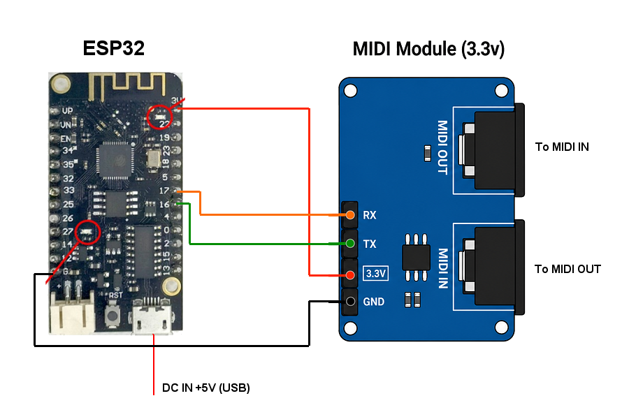
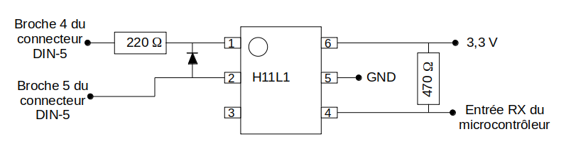
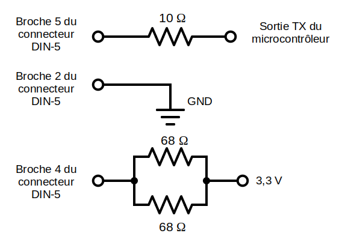
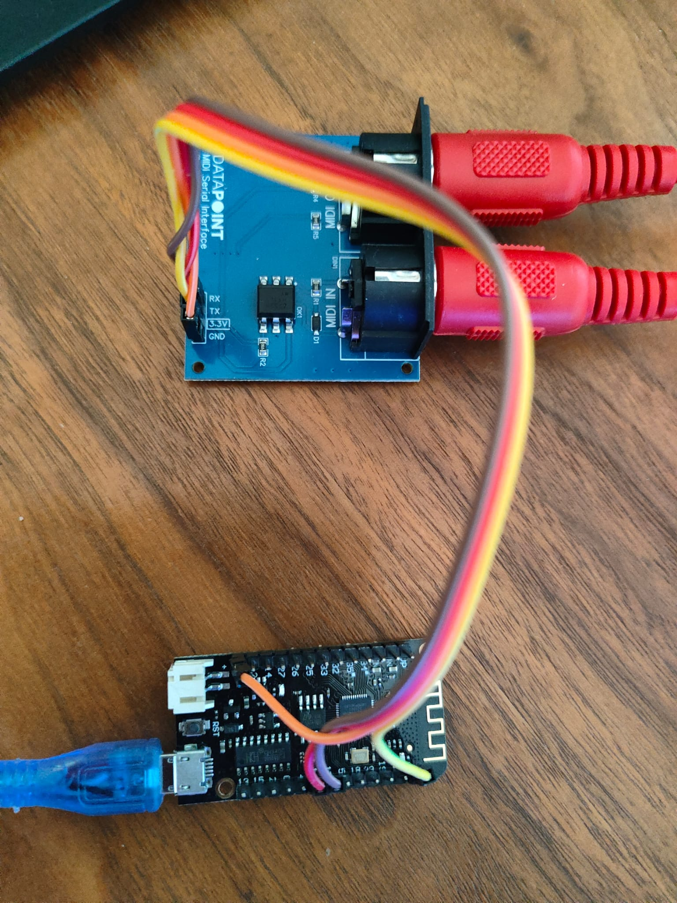

[🇫🇷 Version française](#connecter-le-micro-8-à-internet-avec-un-esp32)

# Connecting the Micro-8 to the Internet with an ESP32

A simple way to connect the Micro-8 to the Internet is to use an **ESP32 running the Zimodem firmware**, connected to the Micro-8's **MIDI-IN and MIDI-OUT** ports.

## 1. The MIDI interface

The first step is to build or obtain the interface that connects the Micro-8's MIDI ports to the ESP32.

I used a **3.3 V MIDI-Serial interface**. It connects on one side to the Micro-8 and on the other side to the ESP32.

For the ESP32, I used an **ESP32 Lolin32 development board**, available for example here:

<https://www.amazon.es/AZDelivery-desarrollo-Lolin32-ESP-32-Bluetooth/dp/B086V1P4BL>

It cost about **€5** at the time of writing (09/2026).

Other equivalent ESP32 development boards should of course work as well.

For the MIDI-Serial interface, since I am not particularly skilled at electronics — soldering and I are not exactly best friends! — I chose to buy a ready-made board:

<https://lectronz.com/products/midi-serial-interface-3-3v>

As far as I know, this board is equivalent to the DIY circuit described in this tutorial:

<https://electroniqueamateur.blogspot.com/2023/09/fabrication-dun-module-midi-in-et-out.html>

*TO MICRO-8 MIDI OUT PORT*

*TO MICRO-8 MIDI IN PORT*

## 2. The Zimodem firmware

On the ESP32, I installed **Zimodem**, a firmware developed by **Bo Zimmerman**. It turns the ESP32 into a Wi-Fi modem controlled using **Hayes-style `AT` commands**.

I made a few modifications to the original firmware, including making **31250 baud** the default speed. This is the speed imposed by the MIDI protocol and cannot be changed on the Micro-8's MIDI port.

This also ensures that the modem always starts at 31250 baud, even if a different speed was previously saved in its configuration.

My modified version of Zimodem is available here:

<https://github.com/ludosevilla/Zimodem-serialMIDI>

## 3. The hardware

The final setup looks like this:

The connections are extremely simple and require only **four wires** between the MIDI-Serial interface and the ESP32.

## 4. Connecting the Micro-8 to the Internet

I then continued the development of **EMinEX** to prepare version 1.0, which allows the Micro-8 to connect to the outside world through my **MiniPavi** gateway.

The program also provides a **"Terminal"** mode, which allows commands to be sent directly to the ESP32 modem. This makes it possible to test and configure the connection without going through EMinEX's higher-level functions.

---

# Connecter le Micro-8 à Internet avec un ESP32

Une solution simple pour connecter le Micro-8 à Internet consiste à utiliser un **ESP32 équipé du firmware Zimodem**, connecté aux ports **MIDI-IN et MIDI-OUT** du Micro-8.

## 1. L'interface MIDI

La première étape consiste à réaliser ou à se procurer l'interface permettant de relier les ports MIDI du Micro-8 à l'ESP32.

J'ai utilisé une **interface MIDI-Serial 3,3 V**. Elle se connecte d'un côté au Micro-8 et de l'autre à l'ESP32.

Pour l'ESP32, j'ai utilisé une carte de développement **ESP32 Lolin32**, disponible par exemple ici :

<https://www.amazon.es/AZDelivery-desarrollo-Lolin32-ESP-32-Bluetooth/dp/B086V1P4BL>

Elle coûtait environ **5 €** au moment de la rédaction (09/2026).

D'autres cartes ESP32 équivalentes peuvent bien entendu convenir.

Pour l'interface MIDI-Serial, n'étant pas particulièrement doué en électronique — les soudures ne sont pas vraiment mes amies ! — j'ai préféré acheter une carte toute faite :

<https://lectronz.com/products/midi-serial-interface-3-3v>

Cette carte est, à ma connaissance, équivalente au montage que l'on peut réaliser soi-même à partir de ce tutoriel :

<https://electroniqueamateur.blogspot.com/2023/09/fabrication-dun-module-midi-in-et-out.html>

*VERS MIDI OUT DU MICRO-8*

*VERS MIDI IN DU MICRO-8*

## 2. Le firmware Zimodem

Côté ESP32, j'ai installé **Zimodem**, le firmware développé par **Bo Zimmerman**. Il permet de transformer l'ESP32 en modem Wi-Fi et se pilote à l'aide de **commandes Hayes de type `AT`**.

J'ai légèrement modifié le firmware d'origine afin, entre autres, que la vitesse par défaut soit toujours fixée à **31250 bauds**. Il s'agit de la vitesse imposée par le protocole MIDI et qui ne peut pas être modifiée sur le port MIDI du Micro-8.

Cela permet également de s'assurer que le modem démarre toujours à 31250 bauds, même si une autre vitesse a été précédemment enregistrée dans sa configuration.

Ma version modifiée de Zimodem est disponible ici :

<https://github.com/ludosevilla/Zimodem-serialMIDI>

## 3. Le montage

Au final, on obtient quelque chose de très simple :

Les connexions sont extrêmement simples et se résument à **quatre fils** entre l'interface MIDI-Serial et l'ESP32.

## 4. Connexion du Micro-8 à Internet

J'ai ensuite poursuivi le développement de **EMinEX** afin de préparer sa version 1.0, qui permet au Micro-8 de se connecter à l'extérieur via ma passerelle **MiniPavi**.

Le programme propose également un mode **« Terminal »**, qui permet d'envoyer directement des commandes au modem ESP32. Cela permet notamment de tester et de configurer la connexion sans avoir à passer par les fonctionnalités de plus haut niveau d'EMinEX.
